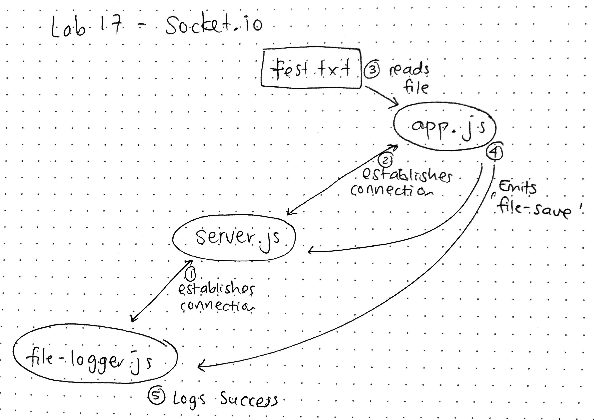

# LAB - 17

## Socket.io

### Author: Joanna Arroyo

### Links and Resources
* [submission PR](https://github.com/joanna-401-advanced-javascript/lab-17-socket-io/pull/1)
* [travis](https://travis-ci.com/joanna-401-advanced-javascript/lab-17-socket-io)

#### Documentation
* [jsdoc](https://github.com/jsdoc/jsdoc)

### Modules
#### `app.js`
#### `server.js`
#### `file-logger.js`

##### Exported Values and Methods
###### `readFile(file) -> object`
###### `convertUppercase(buffer) -> buffer`
###### `writeFile(buffer) -> *`
###### `alterFile(file) -> server.emit`

### Setup

#### Running the app
* `node server/server.js`
* `node logger/file-logger.js`
* `node app/app.js`
* `node app/app.js files/test.txt `
  
#### Tests
* Lint tests: `npm run lint`

#### UML
